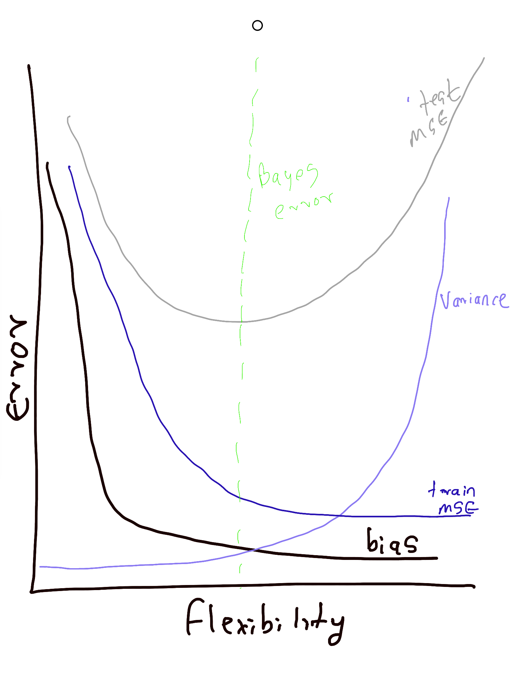

```{r setup, include=FALSE}
knitr::opts_chunk$set(echo = TRUE)
```

# Conceptual

Q.  For each of parts (a) through (d), indicate whether we would generally
expect the performance of a flexible statistical learning method to be
better or worse than an inflexible method. Justify your answer.
(a) The sample size n is extremely large, and the number of predic-
tors p is small. 

We would expect the performance to be better, since if the sample size is large, 
then the variance of the model would be lower. Also, if the number of predictors
is small, then theres also a smaller chance that there could be overfitting with 
the flexible method.


(b) The number of predictors p is extremely large, and the number
of observations n is small. 

The flexible method would be worse off, since it would overfit on the
training data and the variance of the model would be bad. 
(c) The relationship between the predictors and response is highly
non-linear. 

The flexible method would be better off, since the inflexible method would have 
a very high bias, and a flexible method would greatly reduce the bias by a greater
amount as compared to the increase in the variance. 

(d) The variance of the error terms, i.e. σ2 = Var(ε), is extremely
high

The inflexible model would be better, since due to the extremely high variance in the error terms,
the increase in the variance due to the flexible model would make the model performance worse off. 


Q.  Explain whether each scenario is a classification or regression prob-
lem, and indicate whether we are most interested in inference or pre-
diction. Finally, provide n and p. 

(a) We collect a set of data on the top 500 firms in the US. For each
firm we record profit, number of employees, industry and the
CEO salary. We are interested in understanding which factors
affect CEO salary.

* Regression
* Inference 
* n = 500. p = 3

(b) We are considering launching a new product and wish to know
whether it will be a success or a failure. We collect data on 20
similar products that were previously launched. For each prod-
uct we have recorded whether it was a success or failure, price
charged for the product, marketing budget, competition price,
and ten other variables

* Classification
* Prediction 
* n = 20. p = 13

(c) We are interested in predicting the % change in the USD/Euro
exchange rate in relation to the weekly changes in the world
stock markets. Hence we collect weekly data for all of 2012. For
each week we record the % change in the USD/Euro, the %
change in the US market, the % change in the British market,
and the % change in the German market

* Regression
* Prediction 
* n = 52. p = 3

Q. We now revisit the bias-variance decomposition.
(a) Provide a sketch of typical (squared) bias, variance, training er-
ror, test error, and Bayes (or irreducible) error curves, on a sin-
gle plot, as we go from less flexible statistical learning methods
towards more flexible approaches. The x-axis should represent
the amount of flexibility in the method, and the y-axis should
represent the values for each curve. There should be five curves.
Make sure to label each one.



(b) Explain why each of the five curves has the shape displayed in
part (a)

* As the statistical method becomes more flexible, the bias decreases, since the errors between the predicted and actual values go down.
* With a more flexible method, the variance increases, since the amount of change in f if the method was run on a different training data set goes up.
* As the method becomes more flexible, the training MSE monotonically decreases, since the bias decreases at a faster rate for the training dataset as compared to the variance going up.
* For the test set, the MSE initially goes down as the decrease in bias due to more flexibility is greater than the increase in the variance, but beyond a certain limit, the variance starts increasing at a greater rate as compared to the reduction in the bias, which leads to the MSE going up again. 
* The Bayes error is a vertical line that intersects the training MSE at its lowest point. 

Q. What are the advantages and disadvantages of a very flexible (versus
a less flexible) approach for regression or classification? Under what
circumstances might a more flexible approach be preferred to a less
flexible approach? When might a less flexible approach be preferred?

Advantages:
* Bias is low
* prediction can be better
* In cases where the underlying data generation process is non-linear, flexible
methods can yield better results. 

Disadvantages:
* Variance increases as the flexibility increases, leading to worsening training
MSE and therefore worsening model performance with increasing flexibility
* Overfitting can be an issue
* Explanability and interpretability of the model suffers

A more flexible approach can be preferred if the underlying data generation 
process is non-linear, or when there is a very large number of predicters. 

A less flexible approach can be preferred if our focus is on interpretation instead 
of prediction. 


Q. Describe the differences between a parametric and a non-parametric
statistical learning approach. What are the advantages of a para-
metric approach to regression or classification (as opposed to a non-
parametric approach)? What are its disadvantages?

In a parametric approach, we first make an assumption about the functional form of
f. Next, we then estimate the parameters for the functional form that we have 
assumed to model the data. Thus, in short, the parametric approach allows us t
reduce the problem of estimating f to be one of estimating a particular set of
parameters. 

In a non-parametric approach, we do not make any explicit assumtpions about the 
functional form of f. Instead, we make an estimate of f that gets as close to the
data points as possible. 

The advantages of a parametric statistical learning approach is that it is easy 
to estimate the model, f, after an assumption has been made about the functional
form of the model. Also, it does not require a lot of data as compared to the 
non-parametric method, which requires a lot of data. 

The disadvantages of the parametric method is that it can lead to overfitting the
data if we choose too flexible models. On the other hand, in a simpler model, 
the bias of the model can be high. 
